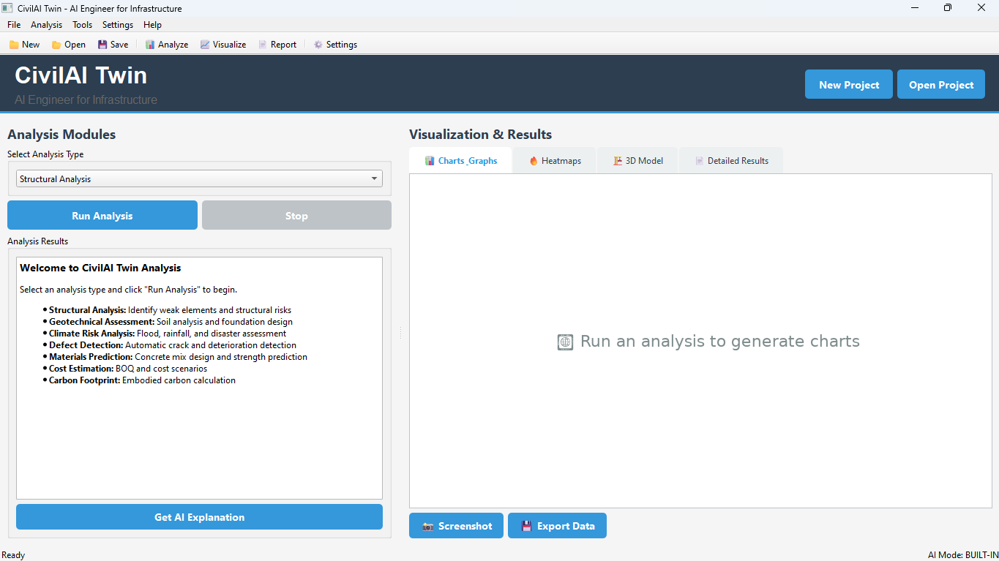
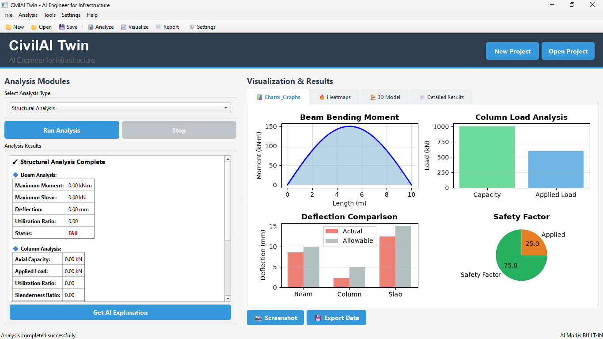
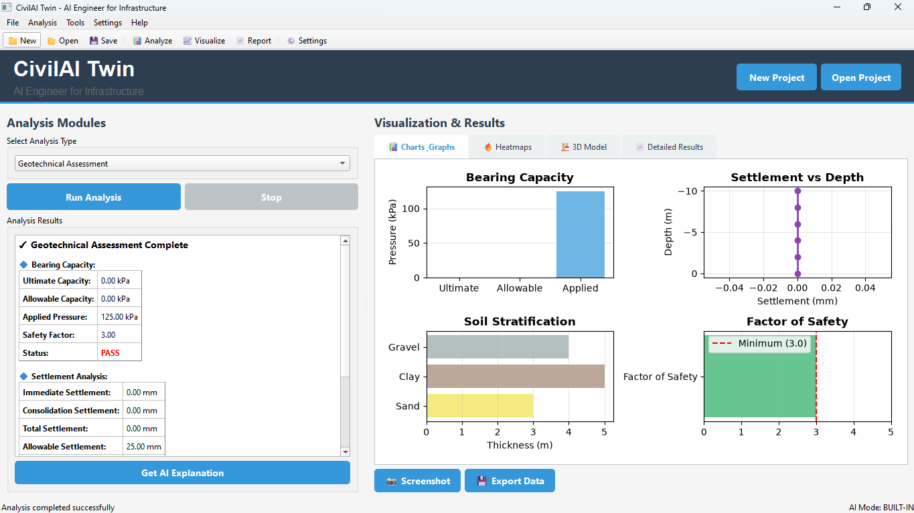
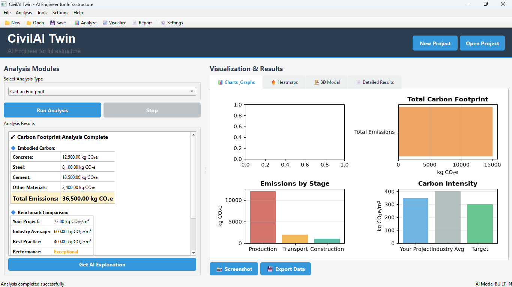
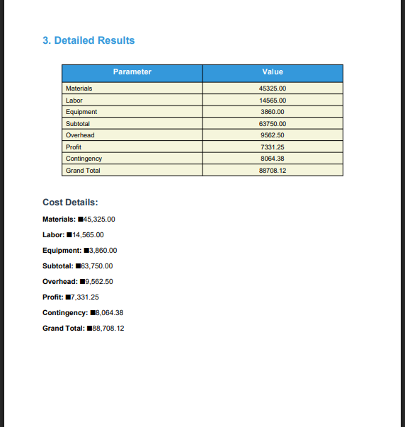

# 🏗️ CivilAI Twin

> **AI-Powered Civil Engineering Analysis & Design Tool**

[](https://www.python.org/downloads/)
[](LICENSE)
[](https://www.microsoft.com/windows)
[]()

**CivilAI Twin** is a comprehensive desktop application that empowers civil engineers with AI-assisted analysis, calculations, and professional report generation. Built with Python and PyQt6, it provides real-time structural, geotechnical, carbon footprint, and cost analysis capabilities.

---

## 📸 Screenshots

### Main Application Interface


### Structural Analysis


### Geotechnical Assessment


### Carbon Footprint Calculator


### PDF Report Generation


---

## ✨ Key Features

### 🔧 **Engineering Analysis Modules**

#### **1. Structural Analysis**
- ✅ Beam design and analysis (IS 456 compliant)
- ✅ Column capacity calculations
- ✅ Slab design (one-way and two-way)
- ✅ Deflection and utilization checks
- ✅ Real-time design verification

#### **2. Geotechnical Assessment**
- ✅ Bearing capacity calculation (Terzaghi's method)
- ✅ Settlement analysis (immediate & consolidation)
- ✅ Foundation stability checks
- ✅ Soil layer modeling
- ✅ Safety factor verification

#### **3. Carbon Footprint Calculator**
- ✅ Material-wise emissions calculation
- ✅ ICE database integration
- ✅ Benchmark comparison (residential/commercial)
- ✅ Reduction recommendations
- ✅ Green building certification support

#### **4. Cost Estimation**
- ✅ Bill of Quantities (BOQ) generation
- ✅ Material and labor cost breakdown
- ✅ Scenario-based estimates (optimistic/pessimistic)
- ✅ Market rate integration
- ✅ Project budgeting tools

#### **5. Climate Risk Analysis**
- ✅ Flood risk assessment
- ✅ Rainfall intensity modeling
- ✅ Temperature range analysis
- ✅ Seismic zone mapping
- ✅ Site-specific recommendations

### 📄 **Report Generation**
- ✅ Professional PDF reports with charts
- ✅ Executive summary and detailed results
- ✅ Engineering recommendations
- ✅ Code compliance documentation
- ✅ Client-ready format

### 🎨 **User Interface**
- ✅ Modern, intuitive PyQt6 interface
- ✅ Real-time data visualization
- ✅ Interactive charts and graphs (Matplotlib)
- ✅ Project save/load functionality
- ✅ Settings and preferences management

### 🤖 **AI Integration**
- ✅ Built-in AI explanations for results
- ✅ OpenAI GPT support (optional)
- ✅ Google Gemini support (optional)
- ✅ Natural language result interpretation

---

## 🚀 Quick Start

### **Option 1: Download Executable (Easiest)**

1. Download the latest release: [CivilAI-Twin.exe](https://github.com/fahadkhan-91/CivilAI-Twin/releases)
2. Extract the ZIP file
3. Run `CivilAI-Twin.exe`
4. No installation required!

### **Option 2: Run from Source**

#### **Prerequisites**
- Python 3.11 or higher
- Windows 10/11 (recommended)
- 2GB+ RAM

#### **Installation Steps**

```bash
# 1. Clone the repository
git clone https://github.com/fahadkhan-91/CivilAI-Twin.git
cd CivilAI-Twin

# 2. Create virtual environment
python -m venv .venv

# 3. Activate virtual environment
# Windows PowerShell:
.venv\Scripts\Activate.ps1
# Windows CMD:
.venv\Scripts\activate.bat

# 4. Install dependencies
pip install -r requirements.txt

# 5. Run the application
python src/main.py
```

---

## 📖 How to Use

### **1. Launch Application**
Double-click the executable or run `python src/main.py`

### **2. Create New Project**
- Click **File → New Project** or press `Ctrl+N`
- Enter project details (name, location, engineer)

### **3. Select Analysis Type**
Choose from the dropdown menu:
- Structural Analysis
- Geotechnical Assessment
- Carbon Footprint Calculator
- Cost Estimation
- Climate Risk Analysis

### **4. Input Parameters**
Fill in the required parameters in the left panel:
- For **Structural**: beam/column/slab dimensions, loads
- For **Geotechnical**: soil properties, foundation geometry
- For **Carbon**: materials list with quantities
- For **Cost**: project scope and BOQ items

### **5. Run Analysis**
- Click the **"Run Analysis"** button
- View real-time results in the results panel
- Check visualizations in the right panel

### **6. Generate Report**
- Click **Tools → Generate Report** or press `Ctrl+R`
- Choose save location
- Professional PDF report will be created

### **7. Get AI Explanation**
- Click **"Get AI Explanation"** button
- AI will interpret the results in natural language
- Understand design implications and recommendations

---

## 📦 Dependencies

### **Core Libraries**
```
PyQt6>=6.6.0              # GUI framework
numpy>=1.24.0             # Numerical computations
scipy>=1.11.0             # Scientific computing
pandas>=2.1.0             # Data manipulation
matplotlib>=3.8.0         # Plotting and visualization
```

### **Analysis & Reporting**
```
reportlab>=4.0.7          # PDF generation
Pillow>=10.1.0            # Image processing
loguru>=0.7.2             # Advanced logging
python-dotenv>=1.0.0      # Environment configuration
```

### **Optional (AI Features)**
```
openai>=1.3.0             # OpenAI GPT integration
google-generativeai>=0.3.0 # Google Gemini integration
```

See [`requirements.txt`](requirements.txt) for complete list.

---

## ⚙️ Configuration

### **Environment Variables**
Create a `.env` file in the project root (copy from `.env.example`):

```env
# AI Configuration (optional)
AI_MODE=builtin              # Options: openai, gemini, local, builtin
OPENAI_API_KEY=your_key_here
GOOGLE_API_KEY=your_key_here

# Application Settings
LOG_LEVEL=INFO               # DEBUG, INFO, WARNING, ERROR
APP_THEME=system             # light, dark, system

# Analysis Defaults
UNITS_SYSTEM=metric          # metric, imperial
CODE_STANDARD=IS             # IS, ACI, BS, EURO
```

### **Code Standards**
The application supports multiple design codes:
- **IS Codes** (Indian Standard) - Default
- **ACI** (American Concrete Institute)
- **BS** (British Standards)
- **Eurocode**

---

## 🏗️ Project Structure

```
CivilAI-Twin/
├── src/                          # Source code
│   ├── main.py                   # Application entry point
│   ├── gui/                      # User interface modules
│   │   ├── main_window.py        # Main application window
│   │   ├── analysis_panel.py     # Analysis controls
│   │   ├── visualization_panel.py # Charts and graphs
│   │   └── settings_dialog.py    # Settings UI
│   ├── core/                     # Core analysis engines
│   │   ├── structural.py         # Structural calculations
│   │   └── geotechnical.py       # Geotechnical analysis
│   ├── analysis/                 # Specialized modules
│   │   ├── carbon_calculator.py  # Carbon footprint
│   │   └── cost_estimator.py     # Cost estimation
│   ├── reporting/                # Report generation
│   │   └── pdf_generator.py      # PDF reports
│   └── utils/                    # Utility functions
│       ├── config.py             # Configuration manager
│       └── logger.py             # Logging setup
├── assets/                       # Application assets
│   └── icon.ico                  # Application icon
├── screenshots/                  # UI screenshots
├── requirements.txt              # Python dependencies
├── CivilAI-Twin.spec            # PyInstaller configuration
├── .env.example                  # Environment template
└── README.md                     # This file
```

---

## 🔨 Building from Source

### **Build Executable**

```bash
# Install PyInstaller
pip install pyinstaller

# Build the executable
pyinstaller CivilAI-Twin.spec --clean --noconfirm

# Executable will be in dist/CivilAI-Twin/CivilAI-Twin.exe
```

### **Build Options**
- `--clean`: Clean PyInstaller cache before building
- `--noconfirm`: Replace output directory without confirmation
- `--windowed`: No console window (already in spec file)
- `--onedir`: Single directory distribution (default)

---

## 📊 Analysis Examples

### **Example 1: Beam Analysis**

**Input:**
```
Width: 300mm
Depth: 450mm
Length: 6.0m
Applied Load: 25 kN/m
```

**Output:**
```
✅ Status: PASS
📊 Maximum Moment: 112.5 kN·m
📊 Maximum Shear: 75 kN
📊 Deflection: 12.5mm
📊 Utilization Ratio: 0.65
```

### **Example 2: Bearing Capacity**

**Input:**
```
Soil Type: Sandy Clay
Cohesion: 20 kPa
Friction Angle: 25°
Foundation: 2m × 2m @ 2m depth
Applied Load: 500 kN
```

**Output:**
```
✅ Status: SAFE
📊 Ultimate Capacity: 342.5 kPa
📊 Allowable Capacity: 114.2 kPa (FOS=3.0)
📊 Applied Pressure: 125.0 kPa
📊 Settlement: 18.5mm (within limits)
```

### **Example 3: Carbon Footprint**

**Input:**
```
Project Area: 500 m²
Concrete M25: 50 m³
Steel Rebar: 4500 kg
Cement OPC: 15 tonnes
Bricks: 10 tonnes
```

**Output:**
```
📊 Total Carbon: 32,000 kg CO₂e
📊 Per m²: 64 kg CO₂e/m²
✅ Performance: EXCEPTIONAL
📊 vs Industry Average: -89% (600 kg CO₂e/m²)
```

---

## 🧪 Testing

### **Manual Testing**
1. Run the application
2. Test each analysis module
3. Generate sample reports
4. Verify calculations against manual computations

### **Unit Tests** (Coming Soon)
```bash
pytest tests/
```

---

## 🤝 Contributing

We welcome contributions! Here's how you can help:

### **Ways to Contribute**
- 🐛 Report bugs and issues
- 💡 Suggest new features
- 📖 Improve documentation
- 🔧 Submit pull requests
- ⭐ Star the repository

### **Development Workflow**
1. Fork the repository
2. Create a feature branch: `git checkout -b feature/amazing-feature`
3. Make your changes
4. Commit: `git commit -m 'Add amazing feature'`
5. Push: `git push origin feature/amazing-feature`
6. Open a Pull Request

### **Code Style**
- Follow PEP 8 guidelines
- Add docstrings to functions and classes
- Include type hints where appropriate
- Write clear commit messages

---

## 📝 License

This project is licensed under the **MIT License** - see the [LICENSE](LICENSE) file for details.

```
MIT License

Copyright (c) 2024 CivilAI Team

Permission is hereby granted, free of charge, to any person obtaining a copy
of this software and associated documentation files (the "Software"), to deal
in the Software without restriction...
```

---

## 🔗 Links & Resources

### **Documentation**
- 📚 [Complete Documentation](COMPLETE_APP_DOCUMENTATION.md) *(optional)*
- 🔨 [Build Guide](HOW_TO_BUILD.md) *(optional)*
- 📋 [Release Notes](RELEASE_NOTES.md) *(optional)*

### **Standards & Codes**
- [IS 456:2000](https://www.iitk.ac.in/nicee/codes/IS%20456_2000.pdf) - Plain and Reinforced Concrete
- [IS 1893](https://law.resource.org/pub/in/bis/S03/is.1893.1.2002.pdf) - Earthquake Resistant Design
- [ICE Database](https://circularecology.com/embodied-carbon-footprint-database.html) - Carbon Coefficients

### **Community**
- 🐛 [Report Issues](https://github.com/YourUsername/CivilAI-Twin/issues)
- 💬 [Discussions](https://github.com/YourUsername/CivilAI-Twin/discussions)
- 📧 Email: your.email@example.com

---

## 🎓 Educational Use

This tool is designed for:
- ✅ Learning civil engineering concepts
- ✅ Quick preliminary design checks
- ✅ Educational demonstrations
- ✅ Rapid prototyping

**⚠️ Important Note:**
> This software is intended for preliminary analysis and educational purposes. All designs should be reviewed and stamped by a licensed professional engineer before construction. The developers assume no liability for design decisions made using this tool.

---

## 🏆 Acknowledgments

### **Built With**
- [Python](https://www.python.org/) - Programming language
- [PyQt6](https://www.riverbankcomputing.com/software/pyqt/) - GUI framework
- [NumPy](https://numpy.org/) - Numerical computing
- [Matplotlib](https://matplotlib.org/) - Visualization
- [ReportLab](https://www.reportlab.com/) - PDF generation

### **Inspired By**
- Modern civil engineering practices
- Industry demand for efficient design tools
- Open-source collaboration

### **Special Thanks**
- Civil engineering community for feedback
- Open-source contributors
- Beta testers and early users

---

## 📈 Roadmap

### **Version 1.0** ✅ (Current)
- ✅ Core structural analysis
- ✅ Geotechnical calculations
- ✅ Carbon footprint calculator
- ✅ PDF report generation
- ✅ Basic AI integration

### **Version 1.1** 🚧 (In Progress)
- 🔄 Enhanced visualization (3D models)
- 🔄 Database integration for material properties
- 🔄 Import from BIM models (IFC format)
- 🔄 Multi-language support

### **Version 2.0** 📅 (Planned)
- 📅 Cloud collaboration features
- 📅 Mobile app companion
- 📅 Advanced AI design suggestions
- 📅 Real-time code updates
- 📅 Defect detection with computer vision

---

## ❓ FAQ

### **Q: Is this free to use?**
A: Yes! It's open-source under MIT License.

### **Q: Does it work offline?**
A: Yes, AI features are optional. Core functionality works offline.

### **Q: Can I use it for commercial projects?**
A: For preliminary analysis only. Professional engineer review required.

### **Q: Which design codes are supported?**
A: Currently IS Codes (Indian). ACI, BS, Eurocode coming soon.

### **Q: How accurate are the calculations?**
A: Follows standard formulas and design codes. Always verify critical designs.

### **Q: Can I add custom analysis modules?**
A: Yes! The code is modular and extensible.

### **Q: Does it require internet?**
A: No, except for AI features (OpenAI/Gemini).

### **Q: What about Mac or Linux?**
A: Currently Windows-optimized. Linux/Mac support planned.

---

## 🐛 Known Issues

- PDF generation may be slow for large projects (optimization in progress)
- Some matplotlib charts may not render on high-DPI displays
- Climate risk module uses simplified models (detailed analysis coming)

See [Issues](https://github.com/YourUsername/CivilAI-Twin/issues) for complete list.

---

## 📞 Support

### **Getting Help**
- 📖 Read the documentation
- 🔍 Search existing issues
- 💬 Start a discussion
- 📧 Email support

### **Reporting Bugs**
1. Check if issue already exists
2. Provide clear description
3. Include screenshots if possible
4. Share error logs from `logs/` folder
5. Mention Python and OS version

---

## 📊 Statistics


---

## 🌟 Star History

If you find this project helpful, please consider giving it a star! ⭐

[](https://star-history.com/#YourUsername/CivilAI-Twin&Date)

---

## 📅 Version History

### **v1.0.0** - August 2024
- 🎉 Initial release
- ✅ Core analysis modules
- ✅ PDF report generation
- ✅ PyQt6 GUI
- ✅ Windows executable

See [RELEASE_NOTES.md](RELEASE_NOTES.md) for detailed changelog.

---

<div align="center">

**Made with ❤️ by Civil Engineers, for Civil Engineers**

[⬆ Back to Top](#-civilai-twin)

</div>

---

© 2024 CivilAI Twin. All Rights Reserved.
